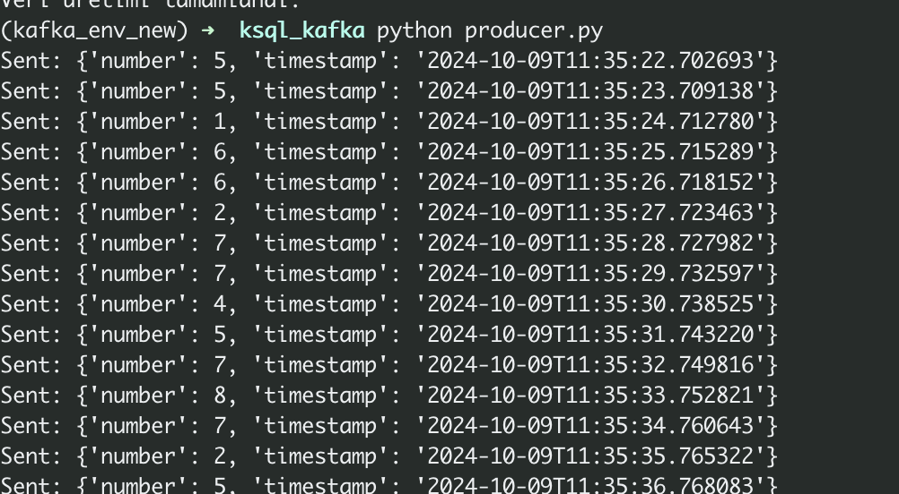
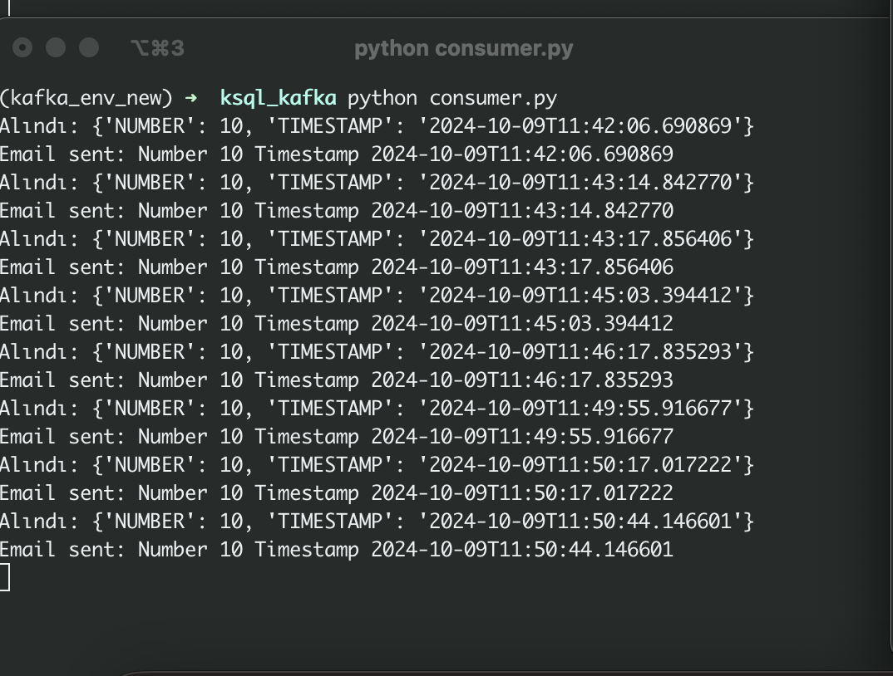
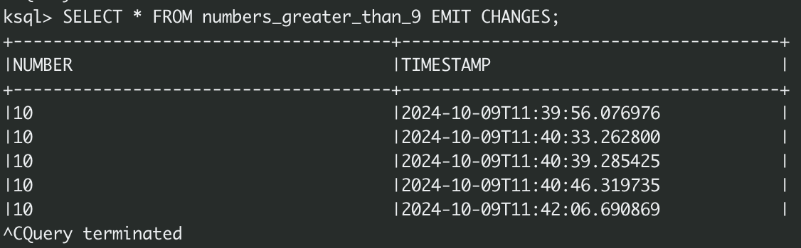
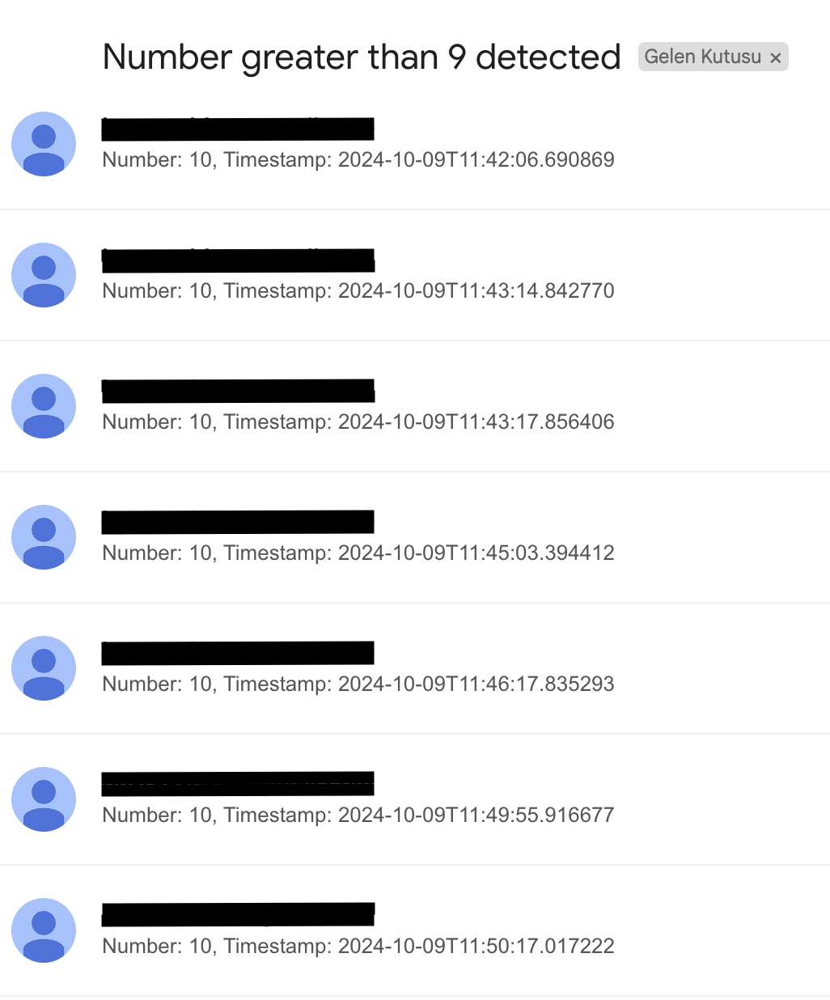

# Real Time Data Processing with Kafka and ksqlDB

This project demonstrates real-time data processing using Python and Apache Kafka, containerized with Docker. It involves generating random integers and sending them to a Kafka topic along with a timestamp. The random number generator is designed to have a low probability of producing the numbers 9 and 10. A KSQL query is then used to process the data, and when a number greater than 9 is detected, an email notification is sent.


* Producer (`producer.py`): Generates random integers and sends them to the Kafka topic `random_numbers` with a timestamp.

* Dockerized Kafka and KSQL Servers: The Kafka broker and KSQL server are containerized using Docker and managed via Docker Compose.

* KSQL: 
    * Creates a stream from the random_numbers topic.
    * Processes the stream and filters out numbers greater than 9.
    * Writes the filtered data to a new topic `NUMBERS_GREATER_THAN_9`.

* Consumer (`consumer.py`):
    * Consumes messages from the `NUMBERS_GREATER_THAN_9` topic.
    * Sends an email notification containing the number and timestamp.


This project can be build by simply running this command:

``` 
docker-compose up --build -d
```

1. Run the `producer.py` script to start generating random numbers and sending them to Kafka.

``` 
python producer.py
```



2. Use KSQL CLI to create streams and process data. Access the KSQL CLI

```
docker exec -it ksqldb-cli ksql http://primary-ksqldb-server:8088
```

```
CREATE STREAM random_numbers_stream (
   number INT,
   timestamp VARCHAR
) WITH (
   KAFKA_TOPIC='random_numbers',
   VALUE_FORMAT='JSON'
);
```

```
CREATE STREAM numbers_greater_than_9 AS
SELECT number, timestamp
FROM random_numbers_stream
WHERE number > 9
EMIT CHANGES;
```

3. Run the `consumer.py` script to start generating random numbers and sending them to Kafka.

```
python consumer.py
```


4. You can also check datas from ksql cli




5. An e-mail will be sent whenever the randomly generated number is greater than 9.

